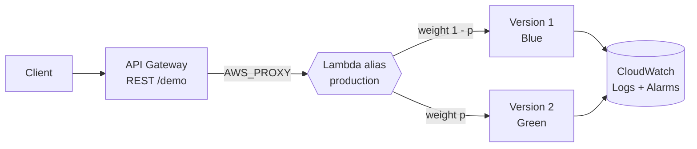

# Lambda Safe Deployments: Blue-Green and Canary with Terraform

Zero-downtime, instantly reversible AWS Lambda releases using immutable function versions, a weighted alias, and API Gateway, all provisioned with Terraform.


-FF4F8B)


---

## Table of Contents

- [Problem](#problem)
- [Solution](#solution)
- [Architecture](#architecture)
- [How Traffic Shifting Works](#how-traffic-shifting-works)
- [Key Components](#key-components)
- [Prerequisites](#prerequisites)
- [Project Structure](#project-structure)
- [Configuration](#configuration)
- [Usage](#usage)
- [Monitoring](#monitoring)
- [Rollback](#rollback)
- [Cleanup](#cleanup)
- [Limitations and Next Steps](#limitations-and-next-steps)

---

## Problem

Production workloads need continuous change, but traditional deployments cause downtime, service disruption, and painful rollbacks when something breaks. Without a safe deployment pattern, a single faulty release can affect thousands of users before anyone reacts.

## Solution

Use Lambda's built-in versioning together with an alias and weighted routing to implement two release strategies:

- **Blue-Green**: run the old (blue) and new (green) versions side by side, then flip all traffic at once by repointing the alias.
- **Canary**: send a small percentage of traffic to the new version first, watch the metrics, then promote or roll back.

API Gateway invokes the **alias**, never a fixed version, so shifting traffic is a configuration change on the alias rather than a redeploy. Published versions are immutable, which makes rollback instant and requires no rebuild.

## Architecture




## How Traffic Shifting Works

Two feature flags control where the `production` alias points:

| Stage | `enable_blue_green_deployment` | `enable_canary_deployment` | Result |
|---|---|---|---|
| Blue (100% v1) | `false` | `false` | Alias points to v1 only |
| Canary | `true` | `true` | Alias points to v2; v1 keeps `(100 - canary_traffic_percentage)%` of traffic, so v2 receives `canary_traffic_percentage`% |
| Green (100% v2) | `true` | `false` | Alias points to v2 only |

> **Note:** Both flags default to `true`, so a plain `terraform apply` starts in the **canary** state (10% to v2). Canary requires blue-green to be enabled.

## Key Components

- **Lambda function** with published, immutable versions (v1 = blue, v2 = green)
- **Lambda alias (`production`)** with weighted routing across versions
- **API Gateway REST API** with an `AWS_PROXY` integration targeting the alias, not a fixed version
- **CloudWatch alarms** on Lambda errors and duration, and API Gateway 4xx/5xx, to catch a bad canary
- **IAM execution role** limited to `AWSLambdaBasicExecutionRole`, or bring your own role
- **CloudWatch log group** with configurable retention

### Tech Stack

| Layer | Technology |
|---|---|
| Infrastructure as Code | Terraform |
| Compute | AWS Lambda (Python) |
| API | Amazon API Gateway (REST, regional) |
| Monitoring | Amazon CloudWatch (logs, metrics, alarms) |
| Security | Least-privilege IAM |

## Prerequisites

- An AWS account with credentials configured (`aws configure` or environment variables)
- AWS CLI v2
- Terraform >= 1.5
- `curl` and `jq` for testing (optional)
- Estimated cost: roughly $1-5 if left running; negligible if destroyed after testing

> The Lambda execution role needs CloudWatch Logs permissions so deployment health and performance can be monitored. The default role created by this project already includes them.

## Project Structure

```
.
├── main_lambda_safe_deploy.tf   # IAM, Lambda versions, alias, API Gateway, CloudWatch alarms
├── variables.tf                 # Input variables with validation
├── outputs.tf                   # Endpoint URL, alias ARN, test and rollback commands
├── providers.tf                 # Provider configuration
├── image.png                    # Architecture diagram
└── README.md
```

The v1 and v2 handler source files (`lambda_function_v1.py`, `lambda_function_v2.py`) and their zip archives are generated by Terraform at apply time.

## Configuration

Override any variable in a `terraform.tfvars` file.

| Variable | Default | Description |
|---|---|---|
| `aws_region` | `us-east-1` | Region to deploy into |
| `environment` | `dev` | One of `dev`, `staging`, `prod` |
| `resource_prefix` | `lambda-deploy` | Prefix for resource names |
| `use_random_suffix` | `true` | Append a random suffix to avoid name collisions |
| `function_name` | `deployment-patterns-demo` | Lambda function name |
| `lambda_runtime` | `python3.9` | One of `python3.9` to `python3.12` |
| `lambda_timeout` | `30` | Seconds (1-900) |
| `lambda_memory_size` | `128` | MB (128-10240) |
| `api_name` / `api_stage_name` | `deployment-api` / `prod` | API Gateway name and stage |
| `enable_blue_green_deployment` | `true` | Point the alias at v2 when `true`, v1 when `false` |
| `enable_canary_deployment` | `true` | Enable weighted routing on the alias |
| `canary_traffic_percentage` | `10` | Percent of traffic sent to v2 (0-100) |
| `cloudwatch_retention_days` | `14` | Log retention |
| `error_alarm_threshold` | `5` | Errors per period before the alarm fires |
| `error_alarm_evaluation_periods` | `2` | Periods evaluated for the error alarm |
| `use_existing_lambda_execution_role` | `false` | Reuse an existing IAM role |
| `existing_lambda_execution_role_arn` | `""` | Required when the above is `true` |
| `additional_tags` | `{}` | Extra tags applied to all resources |

Example `terraform.tfvars`:

```hcl
aws_region                   = "us-east-1"
lambda_runtime               = "python3.12"
enable_blue_green_deployment = true
enable_canary_deployment     = true
canary_traffic_percentage    = 10
```

## Usage

### 1. Initialize

```bash
terraform init
```

### 2. Review the plan

```bash
terraform plan -out=tfplan
```

### 3. Deploy 100% Blue (version 1 only)

```hcl
# terraform.tfvars
enable_blue_green_deployment = false
enable_canary_deployment     = false
```

```bash
terraform plan -out=tfplan
terraform apply tfplan
```

### 4. Verify the endpoint

```bash
curl -s "$(terraform output -raw api_gateway_url)" | jq .
```

The response includes `"environment": "blue"` or `"green"`, so you can see which version served each request. Run it in a loop to observe the split during a canary:

```bash
for i in $(seq 1 20); do
  curl -s "$(terraform output -raw api_gateway_url)" | jq -r .environment
done | sort | uniq -c
```

### 5. Ship a canary (10% to version 2)

```hcl
# terraform.tfvars
enable_blue_green_deployment = true
enable_canary_deployment     = true
canary_traffic_percentage    = 10
```

```bash
terraform plan -out=tfplan
terraform apply tfplan
```

The alias now points at v2, with v1 retaining the remaining 90% of traffic.

### 6. Promote to 100% Green (complete the blue-green cutover)

```hcl
enable_blue_green_deployment = true
enable_canary_deployment     = false
```

```bash
terraform apply
```

### 7. Inspect the alias at any time

```bash
aws lambda get-alias \
  --function-name "$(terraform output -raw lambda_function_name)" \
  --name production
```

## Monitoring

Terraform creates four CloudWatch alarms:

| Alarm | Metric | Condition |
|---|---|---|
| Lambda error rate | `AWS/Lambda` `Errors` (Sum) | Above `error_alarm_threshold` |
| Lambda duration | `AWS/Lambda` `Duration` (Average) | Above 80% of the function timeout |
| API Gateway 4xx | `AWS/ApiGateway` `4XXError` (Sum) | Above 10 per 5 min |
| API Gateway 5xx | `AWS/ApiGateway` `5XXError` (Sum) | Above 5 per 5 min |

Watch these during a canary window before promoting. Alarm actions are empty by default, so add an SNS topic to `alarm_actions` if you want notifications.

## Rollback

Because versions are immutable, rollback is just repointing the alias.

**Via Terraform** (keeps state consistent):

```hcl
enable_blue_green_deployment = false
enable_canary_deployment     = false
```

```bash
terraform apply
```

**Via AWS CLI** (fastest during an incident). Ready-made commands are exposed as outputs:

```bash
terraform output rollback_commands
```

If you roll back with the CLI, reconcile your `.tfvars` afterward so the next `terraform apply` does not undo it.

## Cleanup

```bash
terraform destroy
```

## Limitations and Next Steps

- Traffic shifts are applied manually through variables; promotion and rollback are not yet automated from alarm state.
- Alarms are not wired to notifications by default.
- Possible extensions: CodeDeploy-driven automatic canary and rollback, SNS alerts, a CI/CD pipeline (GitHub Actions) to run plan and apply, and API Gateway stage-level access logging.
